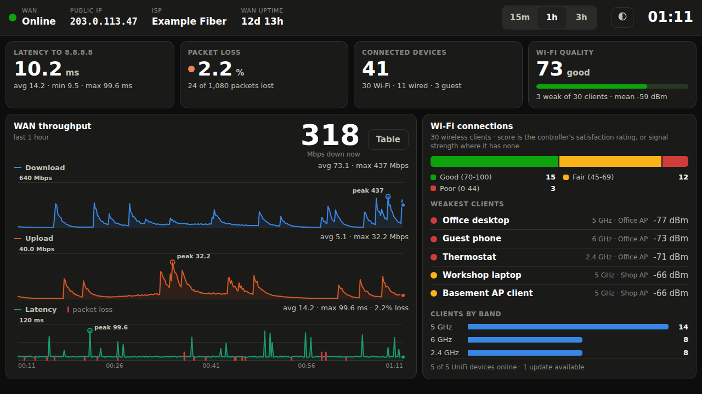
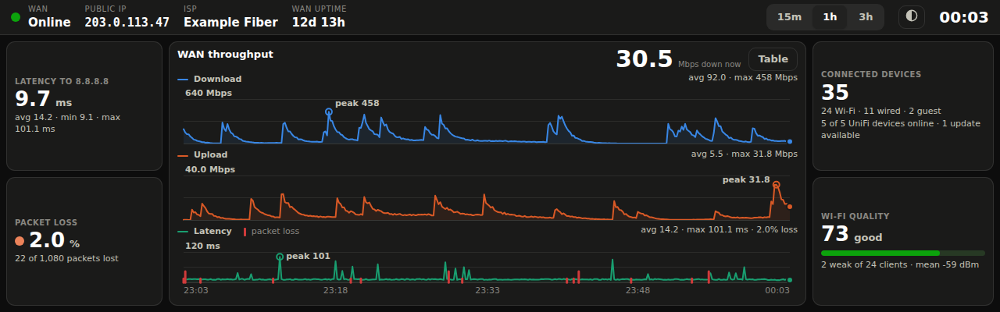

# UniFi dashboard

A wall-panel dashboard for a UniFi network, built for a Raspberry Pi 5 with a
small touchscreen. A Python service polls the UniFi controller and pings the
internet; a single-page kiosk UI shows what the network is doing right now.



On a 1280x400 bar display the layout rearranges into three columns rather than
shrinking:



## What it shows

| Metric | Where it comes from |
|---|---|
| WAN status and public IP | controller health + the gateway's WAN interface |
| Per-WAN status, including a cellular backup | every `wanN` slot on the gateway |
| Whether DNS resolves | a name lookup from the Pi each poll |
| Latency to 8.8.8.8 (now, avg, min, max) | `ping` run **from the Pi**, not the controller |
| WAN packet loss over the window | the same probe, aggregated across the window |
| Connected devices, split Wi-Fi / wired / guest | `stat/sta` |
| WAN download and upload for the last hour | sampled every poll and stored locally |
| Average and peak download / upload | aggregated over the visible window |
| Wi-Fi connection quality | per-client satisfaction, or signal where the controller has none |
| Weakest clients, clients per band, UniFi device health | `stat/sta`, `stat/device` |

Latency and loss are measured from the Pi on purpose. The controller's own
figure is a slow-moving gateway health number that tells you nothing about
whether traffic is actually passing right now.

The graph window is switchable (15m / 1h / 3h) and scopes every number on the
page, so the averages always agree with the plots. Tapping a chart shows a
crosshair with all three series at that moment, and the `Table` button swaps
the plots for the same data in five-minute buckets.

## Chart scale

Throughput is drawn on a **log axis by default**. A small-site WAN is idle most
of the time with occasional bursts - a 200:1 dynamic range is normal - and a
linear axis scaled to the peak renders that as a flat line on the baseline with
one spike owning the scale. Log keeps ordinary traffic legible without clipping
or misrepresenting the peak: gridlines mark the decades, the axis top is
labelled `· log`, and the area wash is dropped because area under a log curve
is not proportional to the value.

Set `throughput_scale = "linear"` under `[charts]` if your link is busy enough
that magnitude comparison matters more. Latency is always linear - its range is
naturally narrow, and log latency reads badly.

## The client directory

The **Connected devices** tile is a button. Tapping it opens a full-screen
directory of every client with its address, name, network, how it is connected
and its signal, sorted by address - numerically, so `.9` comes before `.10`.

It is paged rather than scrolled: thumb-sized Previous / Next buttons and a
Close button, because a scrollbar on a wall panel is something you chase rather
than use. The page size is measured from the space actually available, and on a
wide short display the list runs in two columns filled top-to-bottom, which
roughly halves the paging.

The list is fetched from `/api/clients` when opened, not included in the
polling payload - the panel is usually not showing it, and shipping every
client every few seconds would be waste. It is served from the last poll, so it
is at most one interval old, and the header says how old.

## The alarm state

The panel's first job is to answer "is the internet working" from across the
room, so a fault draws a border around the whole screen - amber for degraded,
red and pulsing for broken - with the reason on a banner. The rules live in
`alarm.py`:

| State | Trigger |
|---|---|
| **critical** | WAN down · no reply from the ping target · DNS not resolving · loss or latency past the critical threshold |
| **warning** | loss or latency past the warning threshold · running on the backup WAN · controller unreachable |

An unreachable controller is deliberately only a warning: it means we cannot
*see* the WAN, which is not the same as the WAN being down.

Thresholds are in the `[alarm]` section of the config. To see the states
without breaking anything:

```bash
python -m unifi_dashboard --demo-fault dns        # or wan-down, loss, latency, failover
```

## Two addresses

The WAN card shows both the address the local network assigned (with its
prefix) and the address the internet sees. On a venue-supplied line - a hotel
handoff, a conference drop - these answer different questions: what their DHCP
gave you, and what you are actually presenting outward. When they differ you
are behind a NAT; when they match you are not, and the card says so.

A **Refresh** button under the public address forces a lookup immediately,
for when something changed upstream and waiting out the interval is not useful.
Only the public address is throttled - the interface address comes from the
controller on every poll - so that is the only thing the button forces.

The public lookup is an outbound request to a third party, so it is throttled
to once per `interval_minutes` plus an immediate lookup whenever the WAN
address changes. Set `enabled = false` under `[public_ip]` for a panel that
makes no external calls. A response that is not a valid IP address - a captive
portal's sign-in page, say - is rejected rather than displayed.

The card also carries the WAN port's MAC address and its negotiated link speed.
The MAC is what venue IT asks for when registering a port; the link speed
appears as a warning badge only when the port negotiated below what it can do
(`1G of 2.5G`), which is a silent half-capacity fault nothing else reports.

**VLAN is not shown**, deliberately. The controller only knows the tag you
configure on your own WAN network, not what the venue runs internally - and on
a typical handoff you are untagged, so there is nothing to report. A field that
reflects your own configuration back at you is worse than no field.

## Dual WAN

UniFi gateways expose each uplink separately, so a primary plus a cellular
backup both appear as chips in the top bar with their own status lamp - active,
standby or down. Tapping one shows that link's detail in the WAN card.

Slots are discovered rather than assumed: numbering is not contiguous in the
wild, and a cellular backup commonly reports as `wan3` with no `wan2`. Cellular
links are recognised from the interface name and labelled as such.

Selecting a cellular link swaps the Internet/DNS/loss row for its radio
detail - signal percentage, RSRP, SINR and the aggregated bands - which is what
you would actually check before blaming the backup.

Note that the internet and DNS checks are measured **from the Pi**, so they
describe whichever link is carrying traffic. Select a standby link and those
checks read as unavailable rather than pretending to describe it.

If a WAN is detected wrongly, `GET /api/debug/wan` returns the gateway's WAN
interfaces exactly as the controller reported them - uplink detail only, no
client names or MAC addresses - which is the payload to share when reporting it.

## Display layouts

The page has three layouts, chosen by viewport rather than by configuration:

| Viewport | Layout |
|---|---|
| Landscape, taller than 460px | Top bar, a row of four stat tiles, then charts beside the Wi-Fi card. |
| **Landscape, 460px or shorter** (bar displays like 1280x400) | Three columns: the WAN card at the left, charts in the middle, devices and Wi-Fi quality at the right. The WAN card takes the largest share, since it is what the panel exists to show; the Wi-Fi detail card is dropped and its device-health line folds into the devices tile. |
| Portrait (the Touch Display 2's native orientation) | One column: tiles two-up, then charts, then the Wi-Fi card. |

Verified at 1280x400, 1024x600, 1280x720 and 720x1280, in both palettes. On a
short landscape panel (around 1024x600) the Wi-Fi card drops its per-band
breakdown and shows three weak clients instead of five, rather than clipping.

## Hardware

- **Raspberry Pi 5** (a 4 also works; the dashboard is not demanding).
- **Raspberry Pi Touch Display 2**, 5" or 7". It connects over DSI with a
  ribbon cable plus GPIO power and needs no drivers on current Pi OS. The panel
  is natively portrait (720x1280); the layout handles both orientations.
- The **27 W USB-C supply**. A 15 W brick will brown out under the display.
- Any HDMI + USB-touch panel works too, with more fiddling over rotation and
  touch-axis mapping.

Do not run the UniFi controller itself on this Pi. It should be a plain client
of your console.

## Install

```bash
git clone https://github.com/joel-hufford/unifi-dashboard.git
cd unifi-dashboard
sudo ./deploy/install.sh
```

That installs into `/opt/unifi-dashboard`, creates a virtualenv, writes
`/etc/unifi-dashboard/config.toml`, and enables a systemd service. Then edit
the config and start it:

```bash
sudo nano /etc/unifi-dashboard/config.toml
sudo systemctl restart unifi-dashboard
journalctl -u unifi-dashboard -f
```

### Updating

The service runs from `/opt/unifi-dashboard`, and its unit sets `ProtectHome`,
so it cannot read your clone in `/home` at all. **A `git pull` on its own
changes nothing the service sees** - the code has to be synced across.

```bash
~/unifi-dashboard/deploy/update.sh
```

That pulls, shows what changed, syncs to `/opt`, refreshes the virtualenv only
if `requirements.txt` moved, restarts the service and checks it came back. It
re-execs itself under `sudo`, and pulls as the clone's owner so it does not
leave root-owned objects behind.

Worth an alias:

```bash
echo "alias dash-update='~/unifi-dashboard/deploy/update.sh'" >> ~/.bashrc
echo "alias dash-log='journalctl -u unifi-dashboard -f'"      >> ~/.bashrc
echo "alias dash-restart='sudo systemctl restart unifi-dashboard'" >> ~/.bashrc
source ~/.bashrc
```

Re-running `deploy/install.sh` also works and is idempotent, but it does a full
`apt-get update` each time. Use it after changing the systemd unit or when the
required packages change; `update.sh` otherwise.

## Controller access

Two ways in, in order of preference:

1. **API key** (UniFi Network 9.x on UniFi OS 4.1+). In the Network app:
   *Settings -> Control Plane -> Integrations -> Create API Key*. Put it in
   `unifi.api_key`, or in `/etc/unifi-dashboard/secrets.env` as
   `UNIFI_DASHBOARD_API_KEY=...` to keep it out of the config file.
2. **A local admin account**, for older controllers. Create a **local-only**
   admin with read-only permissions and 2FA disabled, then set
   `unifi.username` and `unifi.password`. A key is better: the session cookie
   route has to log in again whenever the controller expires it.

Consoles ship a self-signed certificate, so `verify_ssl` is `false` by default.
Point it at the console's certificate file to turn verification on.

The dashboard only ever issues GETs.

### Kiosk browser

```bash
mkdir -p ~/.config/labwc
cp /etc/xdg/labwc/autostart ~/.config/labwc/autostart          # keep the desktop bits
cat /opt/unifi-dashboard/deploy/labwc-autostart.example >> ~/.config/labwc/autostart
chmod 644 ~/.config/labwc/autostart
```

Create it as your login user, not with `sudo`: 644 on the file, 755 on
`~/.config/labwc`. labwc runs it through `sh`, so no execute bit is needed.
A user autostart **replaces** `/etc/xdg/labwc/autostart` rather than adding to
it, which is why the copy comes first — skip it only if you want a bare kiosk
screen with no panel or wallpaper.

Edit the file to set (or remove) the display-mode line, then turn off screen
blanking in `sudo raspi-config` -> Display Options -> Screen Blanking. Reboot.

Do not set the display mode in this file: on Pi OS the labwc session runs
kanshi, which owns output configuration and will stamp over it. If your panel
does not come up at its native resolution — common with 1280x400 bar displays —
see [docs/display-modes.md](docs/display-modes.md).

Raspberry Pi OS Bookworm and later run labwc; on an older Wayfire image the
equivalent goes in `~/.config/wayfire.ini` under `[autostart]`.

## Running it without a controller

The dependencies have to exist first, so either use the virtualenv that
`deploy/install.sh` created:

```bash
/opt/unifi-dashboard/.venv/bin/python -m unifi_dashboard --demo
```

or, to try it before installing anything, make one in the checkout:

```bash
python3 -m venv .venv
.venv/bin/pip install -r requirements.txt
.venv/bin/python -m unifi_dashboard --demo
```

Either serves synthetic data on <http://127.0.0.1:8787/> with an hour of
history already in the graph. Plain `python3 -m unifi_dashboard` uses the
system interpreter, which has none of the dependencies - and on current Pi OS
cannot be given them, since PEP 668 blocks installing into the system
environment. This is how the UI was built and is the fastest way to
try layout changes.

## Configuration

Everything lives in `config.toml`; see `config.example.toml` for the annotated
version. The settings worth knowing:

| Key | Default | Notes |
|---|---|---|
| `poll_interval` | `10.0` | Seconds between controller polls. 10s gives 360 points an hour. |
| `ping.target` | `8.8.8.8` | What "the internet" means for latency and loss. |
| `ping.count` | `3` | Packets per poll. More packets, finer loss resolution. |
| `history.window_minutes` | `60` | The window the page opens on. |
| `history.retention_minutes` | `180` | How much history is kept, and the longest selectable window. |
| `wlan.weak_signal_dbm` | `-70` | At or below this, a client counts as weak. |
| `server.host` | `127.0.0.1` | Set `0.0.0.0` to reach it from other machines. |

The dashboard has no authentication. Leave it bound to localhost unless your
network is one you are happy exposing it to.

## How it fits together

```
UniFi console ──┐
                ├─> poller (every 10s) ─> SQLite ring buffer ─> /api/dashboard ─> kiosk page
ping 8.8.8.8 ───┘
```

- `unifi_client.py` — talks to the controller; handles both auth modes and both
  URL layouts (UniFi OS's `/proxy/network` prefix, and a bare controller).
- `metrics.py` — pure functions turning controller JSON into numbers. UniFi's
  payloads differ across firmware, so each field is looked for in several
  places.
- `ping.py` — the WAN probe, parsed from `ping` output.
- `storage.py` — one row per poll in SQLite, pruned to the retention window,
  with the window aggregates computed in SQL.
- `poller.py` — the loop; also differences the WAN byte counters when the
  firmware does not report instantaneous rates.
- `static/` — the page. No build step, no CDN: it has to render with the WAN
  down.

## Development

```bash
python3 -m venv .venv && . .venv/bin/activate
pip install -e '.[dev]'
pytest
python -m unifi_dashboard --demo
```

## Notes and limitations

- **"Average download" includes idle time.** It is average throughput over the
  window, not average throughput while busy, so an idle hour reads near zero.
  The peak figure is the busiest single poll interval.
- Throughput is sampled at the poll interval, so a burst shorter than ~10
  seconds shows up smaller than it really was.
- Wi-Fi quality uses the controller's own satisfaction score where it exists
  and a signal-strength score where it does not, so the number is comparable
  between clients but is not a UniFi-official metric.
- SD cards do not enjoy constant writes. The history database is small and
  WAL-mode, but an SSD or USB boot drive is kinder if you plan to leave this
  running for years.
